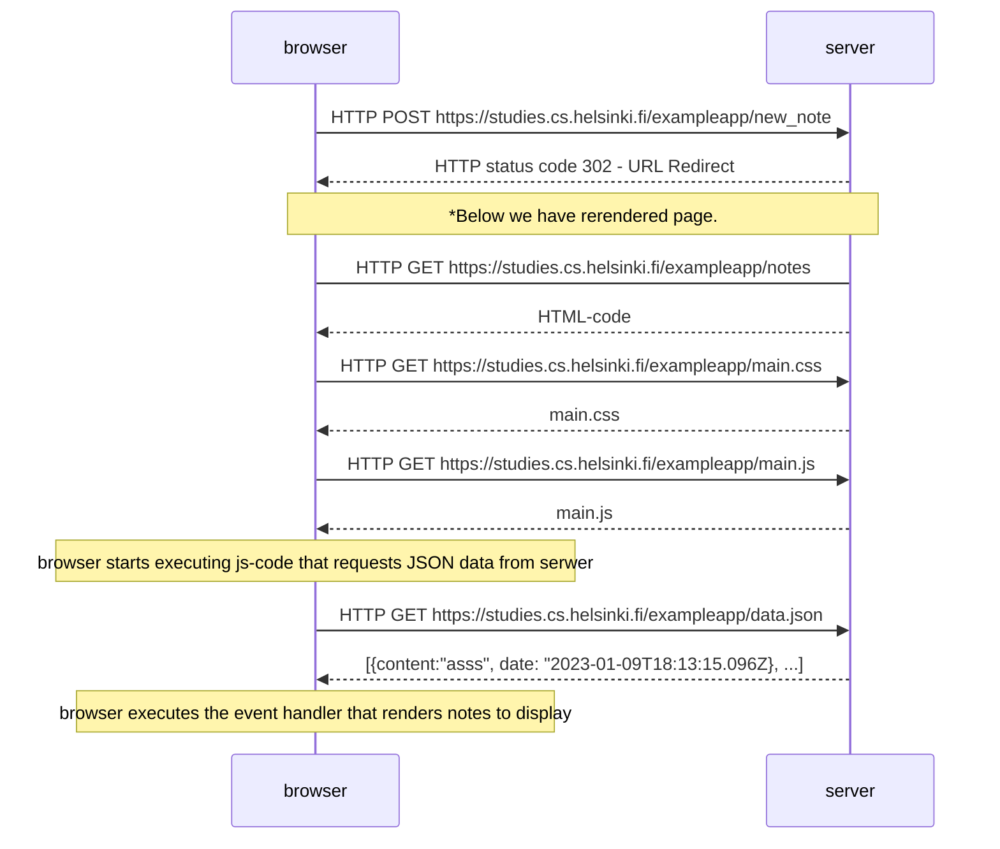
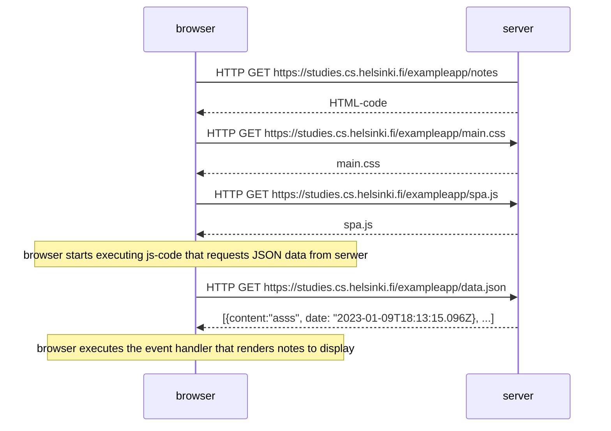
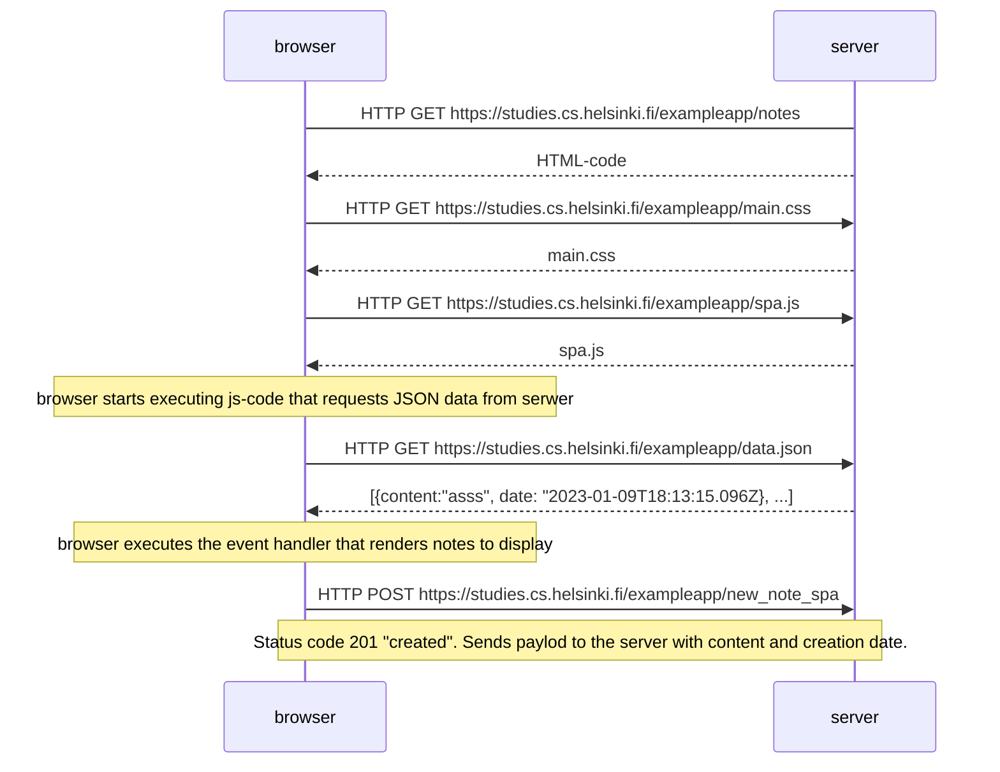

### 0.4 New note diagram
In this case, if we add new record, a POST request will be executed and the whole page will rerender from scratch with the new record in response.
This is very inefficient solution. 

### 0.5 Single page app diagram

### 0.6 New note in Single page app diagram
In this example, website don't rerender. This time the server doesn't ask for a redirect, the browser stays on the same page, and it sends no further HTTP requests. In spa aplications we use AJAX to send data to the server. 
